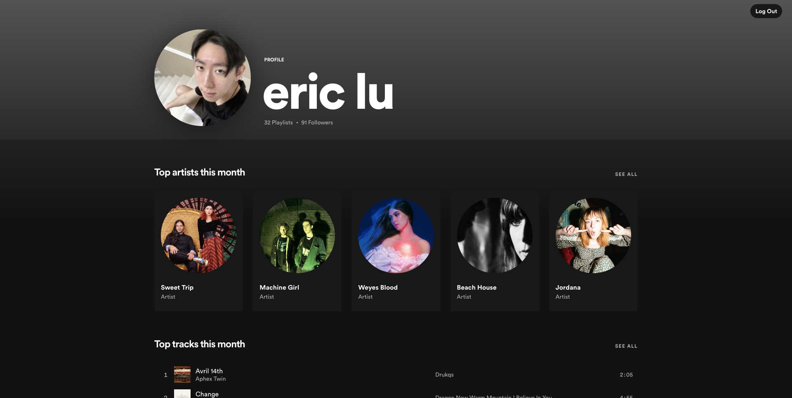
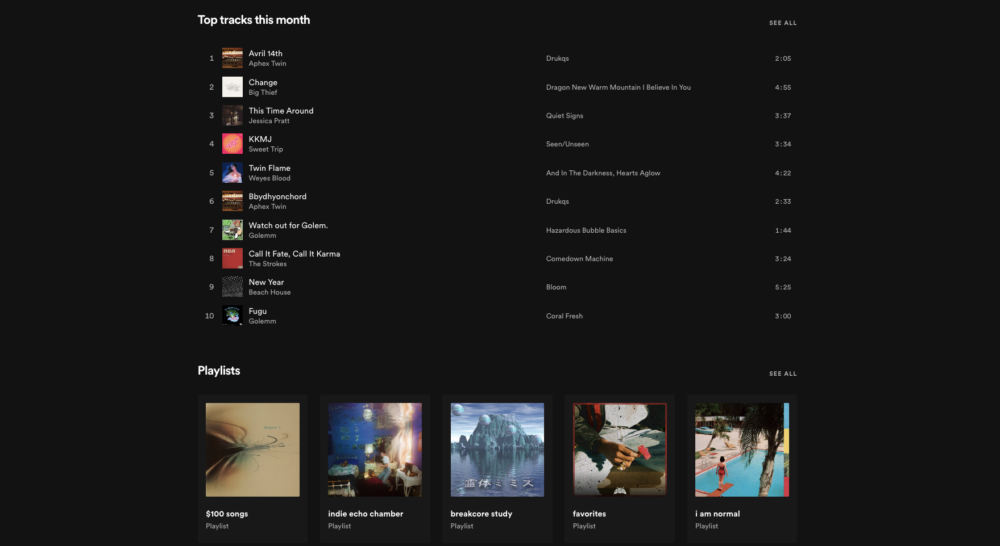
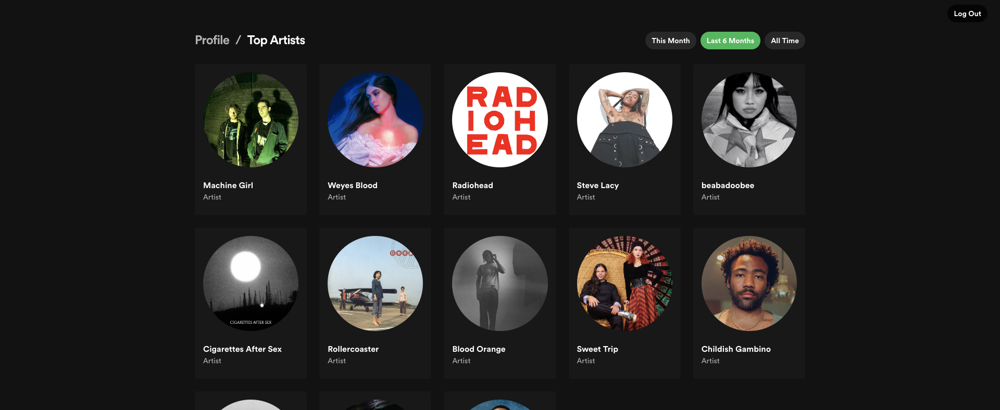
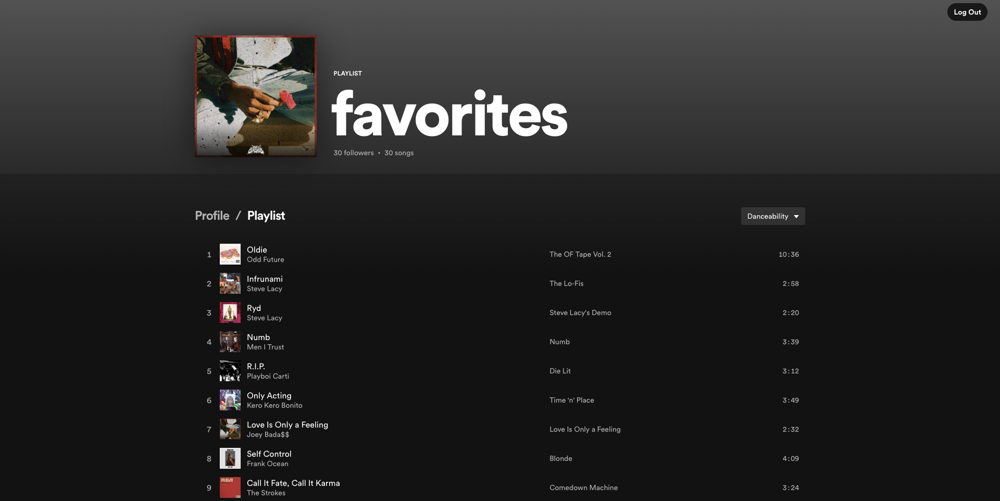

# spotify+

Spotify+ attempts to emulate most of the Spotify profile view's features while also adding additional functionalities that aren't available out-of-the-box like sorting playlists by audio features such as danceability and energy, as well as filtering your top artists and top tracks by time frame!

Due to Spotify's recent changes to their API procedures, only users that are added to the app's authenticated users list will be able to see any data being displayed after logging in.

# technologies:

- Node.js
- Express
- React
- Styled Components
- Spotify API
- Heroku

# learnings:

- working with REST APIs
- implementing OAuth flow to receive and pass tokens
- creating a Node server with Express
- passing data from an API to a React app
- basic routing with React Router
- handling asynchronous code with React Hooks and async/await
- using Styled Components to effectively style in React
- preparing a project for deployment on Heroku
- manipulating JSON objects
